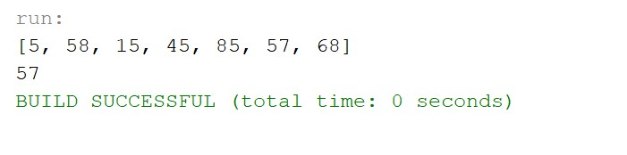
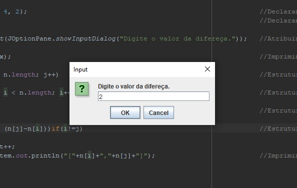
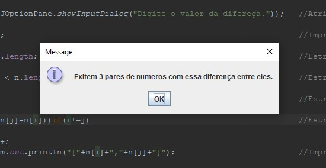
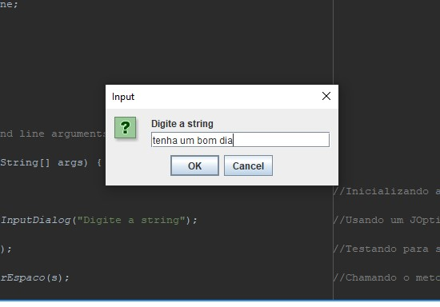
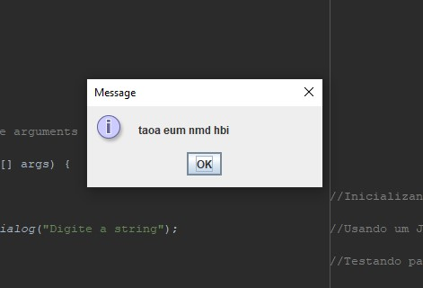

<h1 align="center">DesafioCapgemini02</h1>
 <h2 align="center">Segundo desafio do processo seletivo da capgmini</h2>

Boa tarde meu nome é Gildson carvalho lima nesse Readme trarei as informções sobre as minhas solucoes do desafio 02 do processo seletivo Capgemini ja tinha resolvido o primeiro desafio mas resolvir tambem fazer o segundo defasio

Para a resolção do desafio foi ultilizada a linguagem Java na IDE Netbeans 12.6

Na primeira questão pedia a criação de um algoritmo que encontrasse a mediana de uma lista de numero com numero impar de componentes 

Para isso criei um algoritmo que pega a o array de numeros ordena ela usando o todo sort() e imprimi o valor que se encontra no meio da lista depois que ela foi ordenda imprimindo assim a mediana da lista

No segunda questao foi pedido a criação de algoritmo que tendo um array de numero inteiro e um outro numero qualquer encontrasse no array se existia algum par de valores que tivesse a diferença entre ele igual a o valor informado

Para isso criei um algoritmo que ultiliza duas estruturas de repetição uma para mudar o numero de referencia a ser comparado e outra para mudar o numero que vai ser comparado e um estrutura condicional que testa se  a diferença entre os dois é igual a informada pelo usuario

Entrada

Saida

No terceiro desafio foi pedido a criação de um algoritmo que encriptasse uma string segindo um metodo informado

Para isso criei um Algoritmo que para a string informada e usando um metodo criado por min retira todo os espaços da string usadando o replaceAll depois um outro metodo realiza a encriptaçao usando duas estruturas de repetição para enbaralha a string usando como chave a raiz quadrada do tamanho total da string sem os espaços

Entrada

<>

Saida

<>
